# TenderBot — Instrukcja użytkownika

> Przewodnik praktyczny dla osób, które chcą korzystać z aplikacji bez znajomości technicznych szczegółów.

---

## Spis treści

1. [Co to jest TenderBot?](#1-co-to-jest-tenderbot)
2. [Jak wejść do aplikacji?](#2-jak-wejść-do-aplikacji)
3. [Panel sterowania — Monitor i Streszczenia](#3-panel-sterowania--monitor-i-streszczenia)
4. [Główna lista ogłoszeń](#4-główna-lista-ogłoszeń)
5. [Filtry i sortowanie](#5-filtry-i-sortowanie)
6. [Co zawiera pojedyncze ogłoszenie?](#6-co-zawiera-pojedyncze-ogłoszenie)
7. [Streszczenia AI](#7-streszczenia-ai)
8. [Wyszukiwarka RAG](#8-wyszukiwarka-rag)
9. [Powiadomienia email](#9-powiadomienia-email)
10. [Ustawienia — profile filtrów](#10-ustawienia--profile-filtrów)
11. [Ustawienia — preferowane i ignorowane zwroty](#11-ustawienia--preferowane-i-ignorowane-zwroty)
12. [Ustawienia — ignorowane kody CPV](#12-ustawienia--ignorowane-kody-cpv)
13. [Najczęstsze pytania](#13-najczęstsze-pytania)

---

## 1. Co to jest TenderBot?

TenderBot to automatyczny monitor przetargów publicznych. Każdego dnia przegląda tysiące ogłoszeń z dwóch źródeł:

- **BZP** — Biuletyn Zamówień Publicznych (polskie przetargi, ezamowienia.gov.pl)
- **TED** — Tenders Electronic Daily (przetargi z całej Unii Europejskiej)

Aplikacja filtruje ogłoszenia według profilu firmy, tworzy dla nich streszczenia przy pomocy sztucznej inteligencji i codziennie wysyła email z nowościami.


---

## 2. Jak wejść do aplikacji?

Aplikacja działa w przeglądarce pod adresem:

**`https://tenderbot.cytr.us`**

> 💡 Nie potrzebujesz logowania ani hasła. Wystarczy otworzyć link.

---

## 3. Panel sterowania — Monitor i Streszczenia

W lewym menu bocznym aplikacji, tuż pod nazwą **TenderBot**, znajduje się panel **⚙️ Sterowanie**. Pozwala uruchomić monitor i streszczenia bezpośrednio z przeglądarki — bez potrzeby logowania na serwer.

---

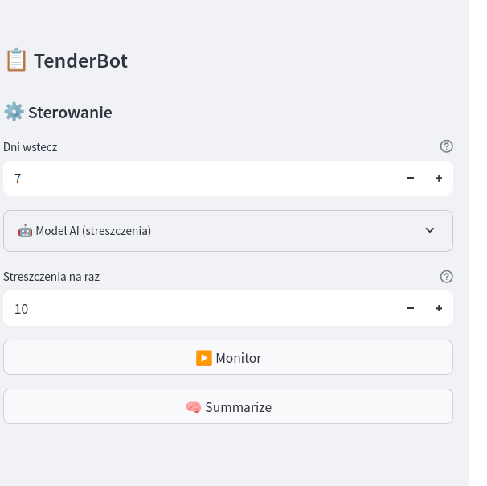

*(Możesz użyć dostarczonego zrzutu ekranu)*

---

### Elementy panelu

| Element | Opis |
|---------|------|
| **Dni wstecz** | Za ile dni wstecz monitor ma szukać nowych ogłoszeń (domyślnie 7) |
| **Model AI** | Który model językowy zostanie użyty do generowania streszczeń |
| **Streszczenia na raz** | Ile ogłoszeń zostanie przetworzonych w jednym uruchomieniu (domyślnie 10) |
| **▶️ Monitor** | Uruchamia pobieranie nowych ogłoszeń |
| **🧠 Summarize** | Uruchamia generowanie streszczeń dla ogłoszeń bez streszczenia |

### Kiedy klikać ▶️ Monitor?

- Gdy chcesz od razu sprawdzić nowe ogłoszenia bez czekania do następnego dnia
- Po zmianie profilu filtrów lub ignorowanych kodów CPV
- Po dodaniu nowych ignorowanych/preferowanych zwrotów

> 💡 Monitor działa też automatycznie raz dziennie — klikanie przycisku jest opcjonalne.

### Kiedy klikać 🧠 Summarize?

- Gdy nowe ogłoszenia nie mają jeszcze streszczenia
- Gdy streszczenie jest nieprawidłowe i chcesz je przegenenerować dla kilku ogłoszeń
- Dla pojedynczych ogłoszeń wygodniej jest użyć przycisku **✍️ Popraw streszczenie** bezpośrednio przy ogłoszeniu

> ⏱️ Generowanie streszczeń zajmuje kilka sekund na ogłoszenie — przy ustawieniu "10 na raz" poczekaj około minuty.

---

## 4. Główna lista ogłoszeń

Po otwarciu aplikacji od razu widzisz listę aktywnych ogłoszeń.

---

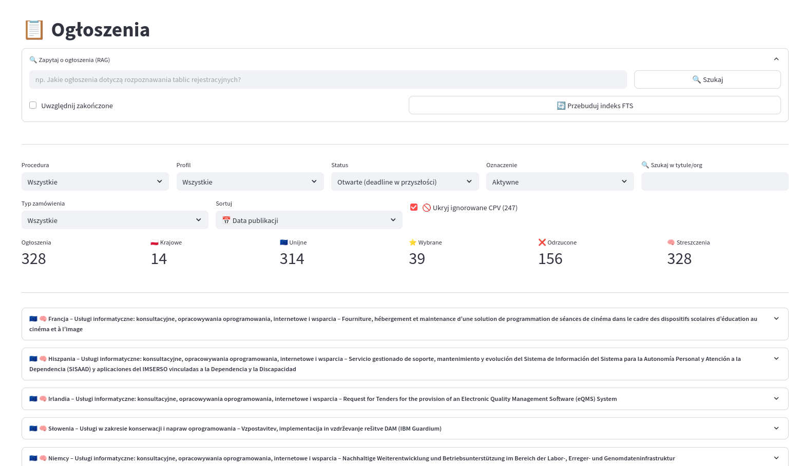

---

Każde ogłoszenie pokazuje:

- **Tytuł** — nazwa przetargu (kliknij żeby rozwinąć szczegóły)
- **Organizacja** — kto ogłosił przetarg
- **Źródło** — `[BZP]` (polskie) lub `[TED]` (zagraniczne)
- **Rodzaj** — `🇵🇱 PL` (poniżej progu UE) lub `🇪🇺 EU` (unijne)
- **Deadline** — ostateczna data składania ofert
- **Streszczenie AI** — skrótowe podsumowanie wygenerowane przez model językowy

---

## 5. Filtry i sortowanie

Nad listą ogłoszeń znajduje się pasek filtrów, który pozwala szybko zawęzić wyniki.


| Filtr | Co robi |
|-------|---------|
| **BZP / TED / Wszystkie** | Pokazuje tylko polskie, tylko europejskie lub wszystkie ogłoszenia |
| **Krajowe / Unijne** | Filtruje wg progu wartości zamówienia |
| **Aktywne / Oznaczone / Odrzucone** | Pokazuje ogłoszenia wg Twojego oznaczenia |
| **Szukaj** | Wyszukuje po słowie w tytule lub nazwie organizacji |
| **Typ zamówienia** | Filtruje usługi / dostawy / roboty budowlane |
| **Sortuj** | Sortuje listę wg daty publikacji, deadline lub oznaczeń |
| **Ukryj ignorowane CPV** | Chowa ogłoszenia z kodami z listy ignorowanych |

---

## 6. Co zawiera pojedyncze ogłoszenie?

Po rozwinięciu ogłoszenia (kliknięcie na tytuł) widzisz szczegóły oraz przyciski akcji.

---

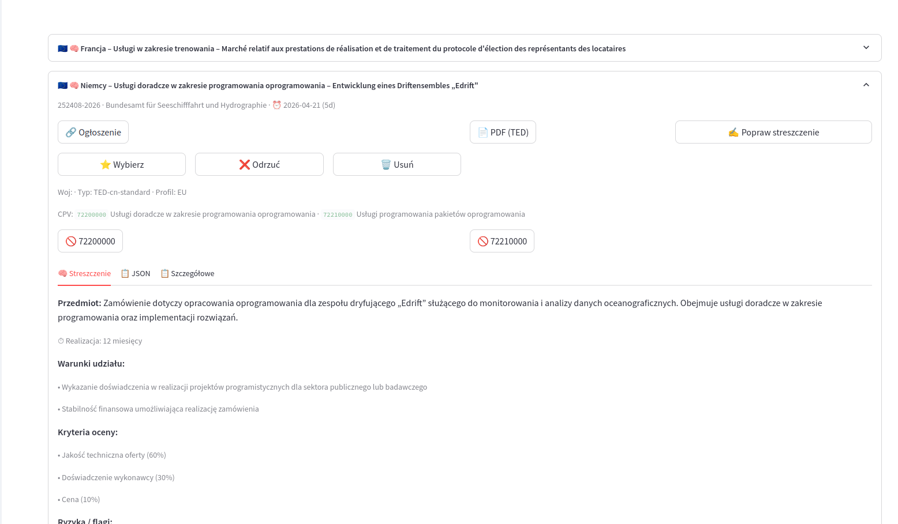

---

### Przyciski akcji

| Przycisk | Co robi |
|----------|---------|
| **⭐ Wybierz** | Oznacza ogłoszenie jako interesujące — trafi do codziennego emaila |
| **↩ Cofnij ⭐** | Usuwa oznaczenie gwiazdką |
| **❌ Odrzuć** | Chowa ogłoszenie z widoku (nie usuwa z bazy) |
| **↩ Przywróć** | Przywraca odrzucone ogłoszenie |
| **🗑️ Usuń** | Trwale usuwa ogłoszenie z bazy |
| **🔗 Ogłoszenie** | Otwiera oryginalne ogłoszenie na stronie BZP lub TED |
| **📄 PDF** | Pobiera pełny dokument ogłoszenia |
| **✍️ Popraw streszczenie** | Generuje nowe streszczenie szczegółowe przez AI |

### Kody CPV

Przy każdym ogłoszeniu widoczne są kody CPV — to standardowy europejski system klasyfikacji zamówień. Każdy kod opisuje rodzaj przedmiotu zamówienia (np. `72000000` = Usługi informatyczne, `34970000` = Urządzenia do monitorowania ruchu).

---

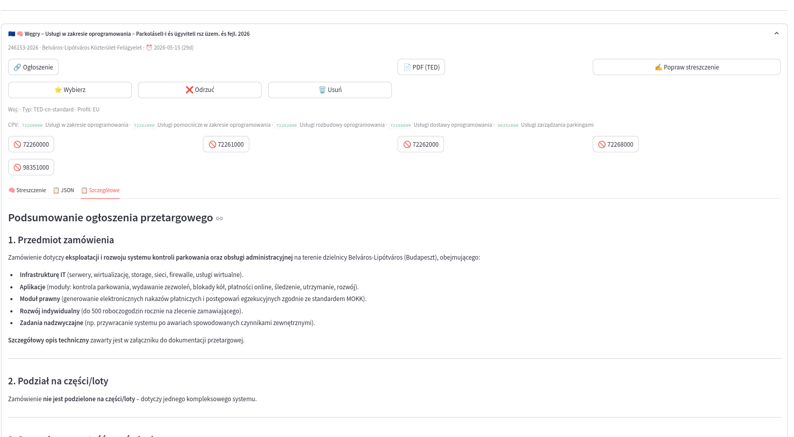

---

Przy każdym kodzie jest przycisk **🚫** — kliknięcie doda kod do listy ignorowanych, przez co podobne ogłoszenia będą automatycznie ukrywane.

---

## 7. Streszczenia AI

TenderBot automatycznie tworzy dwa rodzaje streszczeń dla każdego ogłoszenia, używając modeli językowych (LLM).

> 💡 **Czym jest LLM?** Model językowy (Large Language Model) to rodzaj sztucznej inteligencji, która rozumie i generuje tekst w języku naturalnym — podobnie jak ChatGPT. TenderBot używa go żeby automatycznie przeczytać każde ogłoszenie i napisać po polsku co w nim jest ważne.

### Streszczenie krótkie (strukturalne)

Zwięzłe podsumowanie najważniejszych danych:

- Przedmiot i zakres zamówienia
- Szacunkowa wartość (jeśli podana)
- Kluczowe wymagania
- Termin składania ofert
- Czy wymagane jest wadium

### Streszczenie szczegółowe

Dłuższy opis omawiający zakres prac, warunki udziału, kryteria oceny ofert i inne istotne informacje — napisany naturalnym językiem polskim.

---

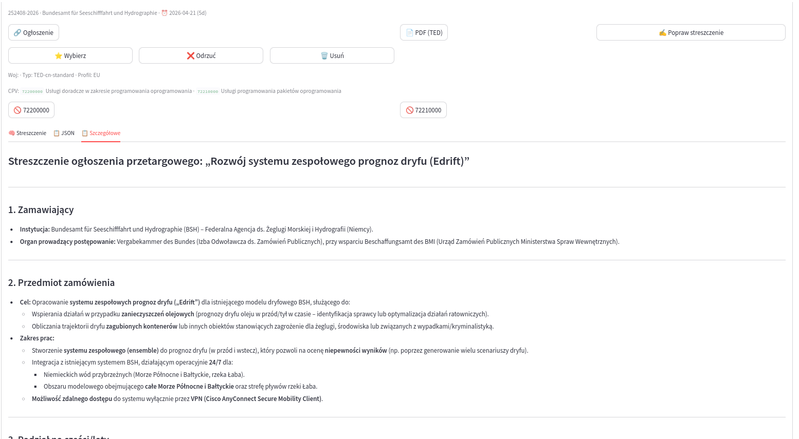

---

> 💡 **Jeśli streszczenie jest nieprawidłowe lub niekompletne**, kliknij **✍️ Popraw streszczenie** — model pobierze aktualne dane z ogłoszenia i wygeneruje nowe. Może to zająć kilka sekund.

---

## 8. Wyszukiwarka RAG

Na górze strony, pod nagłówkiem **„🔍 Zapytaj o ogłoszenia"**, znajdziesz wyszukiwarkę rozumiejącą pytania zadane naturalnym językiem.

> 💡 **Czym jest RAG?** To skrót od *Retrieval-Augmented Generation* — system, który najpierw wyszukuje pasujące ogłoszenia, a potem używa AI żeby sformułować odpowiedź. W praktyce możesz zapytać po polsku i dostaniesz sensowną odpowiedź.

---

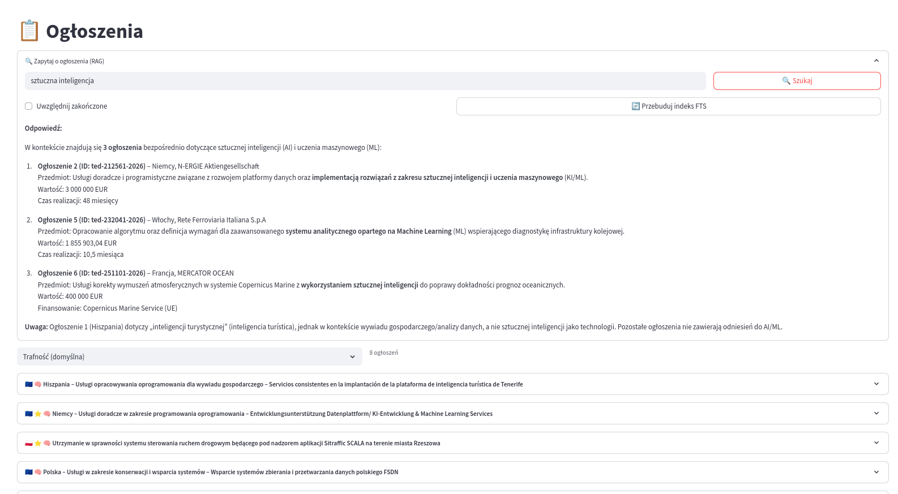

---

### Przykłady pytań

Najlepiej zadawać poprzez krótkie zwroty, np.: parkingi, ale można też bardziej rozbudowane pytania:

```
tablice rejestracyjne
systemy parkingowe
Które ogłoszenia wymagają doświadczenia z NLP lub anonimizacją?
Pokaż przetargi z Wrocławia na systemy monitoringu
SmartCity zarządzania ruchem
```

Wyszukiwarka przeszukuje treść ogłoszeń i streszczeń, rozumiejąc synonimy i powiązane pojęcia — nie musisz używać dokładnych słów z ogłoszenia.

---

## 9. Powiadomienia email

Codziennie rano (o 8:00) na adres email wysyłany jest digest z nowymi ogłoszeniami - **(na razie tylko do mnie)**


Email zawiera:

- ⭐ **Oznaczone ogłoszenia** — wyróżnione na żółto, na górze wiadomości
- 🆕 **Nowe ogłoszenia** — wszystkie nowe z ostatniej doby
- Tytuł, organizacja, deadline i krótkie streszczenie dla każdego
- Bezpośrednie linki do ogłoszeń na BZP lub TED

> 💡 Email zawiera tylko **nowe** ogłoszenia z ostatnich 24 godzin — nie otrzymasz ponownych powiadomień o ogłoszeniach, które już widziałeś wcześniej.

---

## 10. Ustawienia — profile filtrów

Aby przejść do ustawień, kliknij **⚙️ Ustawienia** w lewym menu bocznym aplikacji.

---

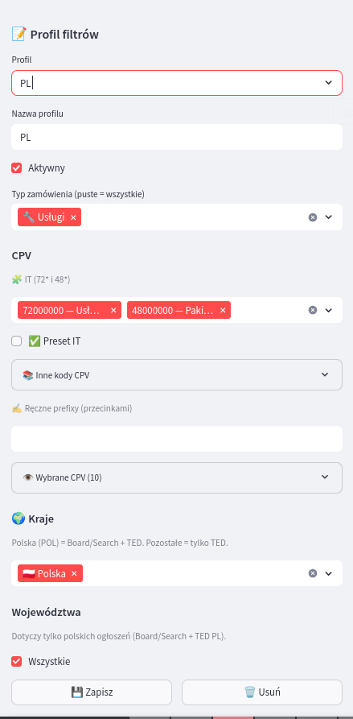


---

**Profil filtrów** określa jakie ogłoszenia są pobierane przez monitor. Możesz ustawić:

- **Kody CPV** — kategorie zamówień które Cię interesują
- **Województwa** — ogranicz do wybranych regionów Polski (działa dla BZP)
- **Typ zamówienia** — usługi, dostawy lub roboty budowlane

> ⚠️ Zmiana profilu wpływa tylko na **nowe** ogłoszenia pobierane od następnego uruchomienia monitora. Ogłoszenia już zapisane w bazie nie zmieniają się.

---

## 11. Ustawienia — preferowane i ignorowane zwroty

To jedna z najważniejszych funkcji — pozwala automatycznie sortować ogłoszenia bez ręcznego przeglądania każdego z nich.

---

<div style="display:flex; gap:16px;">
  <figure style="width:48%; margin:0;">
    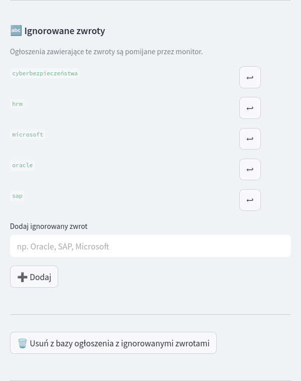
    <figcaption>Preferowane zwroty</figcaption>
  </figure>
  <figure style="width:48%; margin:0;">
    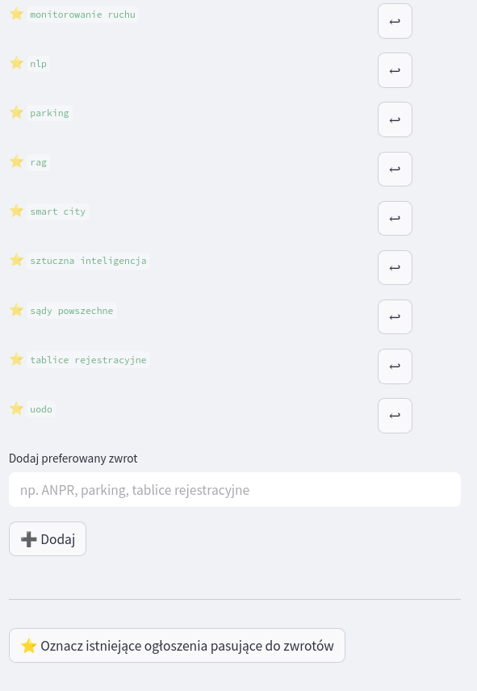
    <figcaption>Ignorowane zwroty</figcaption>
  </figure>
</div>


---

### ⭐ Preferowane zwroty — automatyczna gwiazdka

Kiedy monitor pobiera nowe ogłoszenie i jego tytuł lub nazwa organizacji zawiera któryś z preferowanych zwrotów — ogłoszenie **automatycznie dostaje gwiazdkę ⭐** bez Twojej interwencji.

**Przykłady przydatnych zwrotów dla profilu Neurosoft:**

```
ANPR
tablice rejestracyjne
rozpoznawanie tablic
parking
system parkingowy
ITS
zarządzanie ruchem
NLP
anonimizacja danych
smart city
cyberbezpieczeństwo
sztuczna inteligencja
```

**Jak dodać zwrot:**
1. Wpisz zwrot w pole „Dodaj preferowany zwrot"
2. Możesz dodać kilka naraz, oddzielając przecinkami: `ANPR, parking, ITS`
3. Kliknij **➕ Dodaj**

**Oznacz istniejące ogłoszenia:**
Po dodaniu zwrotów kliknij **„⭐ Oznacz istniejące ogłoszenia pasujące do zwrotów"** — aplikacja przejrzy całą bazę i oznaczy pasujące ogłoszenia. Jeśli włączony jest tryb LLM, zobaczy pasek postępu — może to potrwać chwilę.

### 🔤 Ignorowane zwroty — automatyczne pomijanie

Ogłoszenia zawierające te zwroty są **całkowicie pomijane przez monitor** — nie trafiają do bazy w ogóle.

**Przykłady zwrotów do ignorowania:**

```
Oracle
SAP
Microsoft
szpital
szkoła
leśnictwo
wodociągi
Gemeinde
Krankenhaus
```

Po dodaniu zwrotów możesz kliknąć **„🗑️ Usuń z bazy ogłoszenia z ignorowanymi zwrotami"** — usunie to pasujące ogłoszenia, które już są w bazie danych.

### Jak działa dopasowanie zwrotów?

TenderBot może używać dwóch trybów dopasowania — tryb ustawia administrator w konfiguracji:

**Tryb prosty (domyślny)**
Szuka dokładnego podciągu w tytule. Szybki i niezawodny.
- ✅ `parking` znajdzie „systemu **parking**owego"
- ✅ `ANPR` znajdzie „system **ANPR**"
- ❌ `sądy powszechne` **nie** znajdzie „w **sądach powszechnych**" (inna forma)

**Tryb LLM**
Model językowy rozumie odmiany przez przypadki i synonimy. Wolniejszy, ale dużo skuteczniejszy dla polskich fraz.
- ✅ `sądy powszechne` znajdzie „w **sądach powszechnych**"
- ✅ `ANPR` znajdzie „**rozpoznawanie tablic rejestracyjnych**"
- ✅ `parking` znajdzie „**obsługa miejsc postojowych**"

---

## 12. Ustawienia — ignorowane kody CPV

---


<div style="display:flex; gap:16px;">
  <figure style="width:28%; margin:0;">
    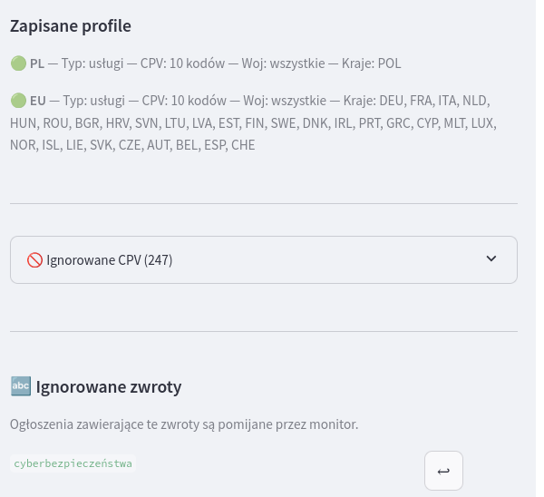
    <figcaption>Ignorowane kody CPV</figcaption>
  </figure>
  <figure style="width:28%; margin:0;">
    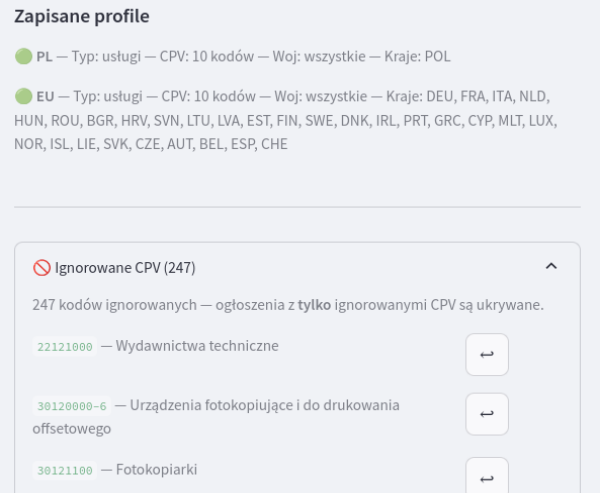
    <figcaption>Ignorowane kody CPV</figcaption>
  </figure>
</div>
---

Lista ignorowanych kodów CPV jest domyślnie **zwinięta** — widać tylko liczbę kodów w nawiasie. Kliknij nagłówek żeby ją rozwinąć.

**Co tu znajdziesz:**
- Pełna lista kodów CPV, które są ignorowane przez monitor i ukrywane w widoku
- Przy każdym kodzie przycisk **↩** — kliknięcie usuwa go z listy ignorowanych

**Jak dodać nowy kod do ignorowania:**
Nie robi się tego tutaj — kliknij **🚫** przy kodzie CPV bezpośrednio w dowolnym ogłoszeniu na głównej liście.

> 💡 Lista jest długa (ponad 190 kodów) dlatego domyślnie jest zwinięta — zawiera kategorie jak systemy medyczne, szkolnictwo, roboty budowlane, meble itp., które nie są związane z profilem firmy.

---

## 13. Ręczne uruchamianie monitora i streszczeń

> Ten rozdział jest przeznaczony dla administratora systemu lub osoby z dostępem do serwera przez SSH.

### Kiedy uruchamiać ręcznie?

Monitor i streszczenia działają automatycznie (cron), ale ręczne uruchomienie przydaje się gdy:

- Chcesz od razu sprawdzić nowe ogłoszenia bez czekania do następnego dnia
- Zmieniłeś profil filtrów lub ignorowane kody CPV i chcesz zastosować zmiany
- Dodałeś nowe preferowane/ignorowane zwroty i chcesz przetworzyć istniejącą bazę
- Streszczenia są puste lub nieprawidłowe i chcesz je przegenenerować

### Połączenie z serwerem

```bash
ssh kwasiucionek@steve141.mikrus.xyz -p 20141
cd ~/TenderBot
```

### Uruchomienie monitora

Pobiera nowe ogłoszenia z BZP i TED za ostatnie 7 dni (168h):

```bash
python3 monitor.py
```

Jeśli chcesz pobrać ogłoszenia z dłuższego okresu (np. ostatnie 30 dni):

```bash
TENDERBOT_HOURS_BACK=720 python3 monitor.py
```

W trakcie działania monitor wypisuje co robi — zobaczysz linie jak:
```
Znanych ogłoszeń (notice_state): 1842
Ignorowane kody CPV: 193
Preferowane zwroty (auto-⭐): 5
[NEW][PL] abc123 | System rozpoznawania tablic rejestracyjnych...
[AUTO-STAR] abc123
```

### Uruchomienie streszczeń

Generuje streszczenia dla ogłoszeń które ich jeszcze nie mają (domyślnie 20 na raz):

```bash
OLLAMA_MODEL=kimi-k2.5:cloud TENDERBOT_LLM_BACKEND=ollama OLLAMA_API_KEY="twój_klucz" TENDERBOT_SUMMARY_BATCH=20 python3 summarize.py
```

Powtarzaj polecenie aż pojawi się komunikat:
```
Brak ogłoszeń do streszczenia.
```

### Ponowne wygenerowanie wszystkich streszczeń szczegółowych

Jeśli chcesz przegenenerować streszczenia od nowa (np. po zmianie modelu):

```bash
# Krok 1: wyzeruj streszczenia szczegółowe (krótkie pozostają nienaruszone)
sqlite3 data/tenderbot.sqlite "UPDATE summaries SET detailed_text = NULL;"

# Krok 2: uruchamiaj aż do skutku
OLLAMA_MODEL=kimi-k2.5:cloud TENDERBOT_LLM_BACKEND=ollama OLLAMA_API_KEY="twój_klucz" TENDERBOT_SUMMARY_BATCH=20 python3 summarize.py
```

### Ręczne wysłanie digestu emailowego

Wysyła email z nowymi ogłoszeniami bez czekania na cron:

```bash
sh run_notifier.sh
```

### Czyszczenie bazy

Usuń odrzucone ogłoszenia (zwalnia miejsce, notice_state pozostaje):

```bash
sqlite3 data/tenderbot.sqlite "
DELETE FROM summaries WHERE object_id IN (SELECT object_id FROM notices WHERE user_status = 'dismissed');
DELETE FROM notices WHERE user_status = 'dismissed';
VACUUM;
"
```

> ⚠️ **Ważne:** Nigdy nie usuwaj tabeli `notice_state` — to pamięć monitora. Bez niej monitor ponownie pobierze wszystkie ogłoszenia przy następnym uruchomieniu.

---

---

## 13. Najczęstsze pytania

**Skąd się biorą ogłoszenia?**
Monitor uruchamia się automatycznie raz dziennie i pobiera nowe ogłoszenia z BZP i TED pasujące do ustawionego profilu filtrów.

**Dlaczego niektóre ogłoszenia nie mają streszczenia?**
Streszczenia są generowane przez AI po pobraniu ogłoszenia. Nowe ogłoszenia mogą przez krótki czas nie mieć streszczenia. Możesz je wygenerować ręcznie klikając **✍️ Popraw streszczenie**.

**Ogłoszenie nie ma streszczenia szczegółowego — co zrobić?**
Starsze ogłoszenia BZP (powyżej 90 dni) mogą być niedostępne przez API. Kliknij **✍️ Popraw streszczenie** — TenderBot spróbuje użyć zapisanej treści. Jeśli to nie zadziała, kliknij **🔗 Ogłoszenie** żeby otworzyć oryginał bezpośrednio na stronie BZP.

**Co oznacza checkbox „Ukryj ignorowane CPV"?**
Checkbox ukrywa ogłoszenia, których kody CPV są na liście ignorowanych. Odznaczenie checkboxa pokaże te ogłoszenia, ale nie usuwa ich z listy ignorowanych — przy ponownym zaznaczeniu znów znikną.

**Dlaczego widzę ogłoszenia po angielsku, niemiecku itp.?**
TED zawiera ogłoszenia z całej UE — wiele jest wyłącznie w języku kraju zamawiającego. Streszczenie AI jest zawsze generowane po polsku, niezależnie od języka oryginału.

**Jak odfiltrować ogłoszenia zagraniczne?**
Użyj filtru **BZP** (tylko polskie) w pasku filtrów. Możesz też dodać nazwy zagranicznych instytucji lub charakterystyczne słowa do **ignorowanych zwrotów** (np. `Gemeinde`, `Krankenhaus`, `université`).

**Skasowałem ogłoszenie przez pomyłkę — czy można je odzyskać?**
Przycisk 🗑️ usuwa ogłoszenie trwale. Pojawi się ono ponownie przy następnym uruchomieniu monitora, jeśli nadal jest aktywne na BZP/TED i pasuje do profilu filtrów.

**Dlaczego niektóre ogłoszenia są automatycznie oznaczone ⭐ lub ❌?**
Monitor automatycznie oznacza ogłoszenia na podstawie ustawionych **preferowanych zwrotów** (⭐) i **ignorowanych zwrotów** (❌ odrzucone). Możesz ręcznie zmienić oznaczenie dowolnego ogłoszenia.

**Co to znaczy „wartość unijne / krajowe"?**
Ogłoszenia `🇪🇺 EU` mają wartość powyżej unijnego progu (ok. 215 tys. EUR dla usług) — są obowiązkowo publikowane w TED. Ogłoszenia `🇵🇱 PL` są poniżej tego progu i publikowane tylko w polskim BZP.

---

*Dokument przygotowany dla Neurosoft Sp. z o.o. · TenderBot v2.0*
